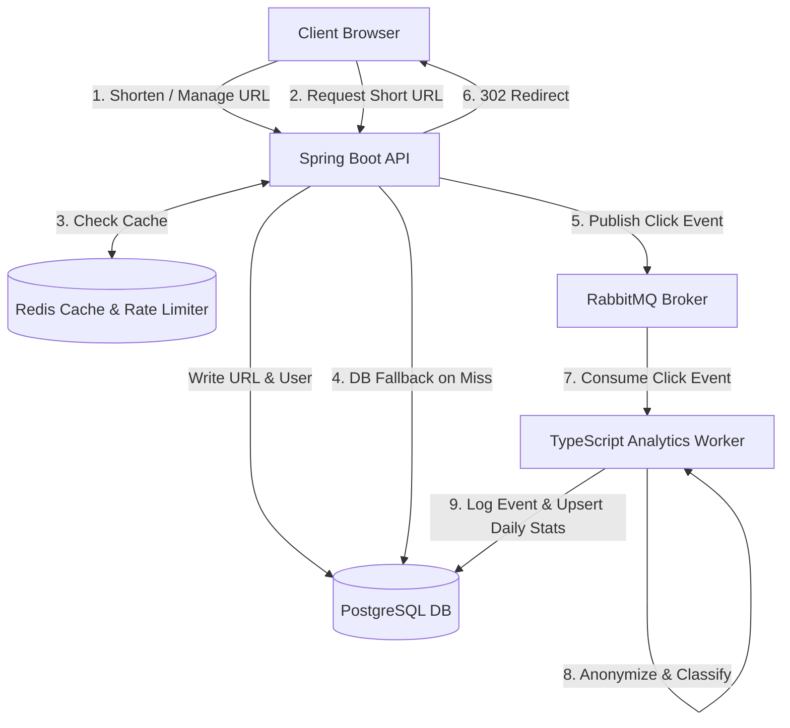

# ShortBrew ☕️

ShortBrew is a high-performance, containerized, and distributed URL Shortener system with real-time asynchronous click analytics. The system is split into a **Spring Boot API (Java 25)**, which handles low-latency redirection and management, and a **Node.js Worker (TypeScript)**, which processes redirect events asynchronously using a queue.

It is designed to handle high redirect traffic using a **Redis cache-aside pattern** and sliding-window rate limiting, while keeping write paths out of the request-response lifecycle by using **RabbitMQ** for event publishing.

---

## 📖 Table of Contents
1. [System Architecture](#-system-architecture)
2. [Key Features](#-key-features)
3. [Technology Stack](#-technology-stack)
4. [Project Structure](#-project-structure)
5. [Getting Started](#-getting-started)
   - [Prerequisites](#prerequisites)
   - [1. Infrastructure Setup](#1-infrastructure-setup)
   - [2. Running the Backend API](#2-running-the-backend-api)
   - [3. Running the Analytics Worker](#3-running-the-analytics-worker)
6. [Detailed Documentation](#-detailed-documentation)

---

## 🏗 System Architecture

ShortBrew is designed with a decoupled, event-driven architecture to ensure that URL redirection remains fast under load:



1. **Cache-Aside Resolution**: The redirection endpoint first checks Redis for the short-code. If it hits, it immediately redirects and pushes an event to RabbitMQ. If it misses, it fetches from PostgreSQL, caches it in Redis, and redirects.
2. **Asynchronous Aggregation**: Click events are sent to RabbitMQ. The TypeScript Worker consumes these messages, classifies device details, resolves geo-location from the IP hash, and updates the analytics database.
3. **Database Aggregation**: Real-time stats are aggregated daily per URL in a JSONB table structure (`url_daily_stats`), ensuring that dashboard analytics remain extremely fast without querying millions of raw rows.

For a deep dive into the design decisions, trade-offs, and database schema, see the [Architecture Documentation](docs/ARCHITECTURE.md).

---

## ✨ Key Features

- **Blazing Fast Redirection**: Cache-aside caching on Redis with a configurable TTL (default 1 hour).
- **Collision-Free Short Codes**: Custom bijective permutation algorithm (based on MurmurHash3's 64-bit finalizer and Base62 encoding) guarantees sequential numbers map to short, non-sequential codes without collisions.
- **Custom Aliases**: Users can define friendly, custom slugs for their target URLs.
- **Asynchronous Data Ingestion**: RabbitMQ separates HTTP response lifecycles from database writes. Redirections are not slowed down by database inserts.
- **Privacy-Preserving Analytics**: IP addresses are hashed using SHA-256 before being published, preventing raw PII from reaching the message queue or database.
- **Sliding-Window Rate Limiting**: Implemented via Redis Lua scripting to limit endpoint abuse (limits URL creation per user and redirection requests per IP).
- **Comprehensive Monitoring**: Integrates Spring Boot Actuator, Prometheus metrics, and native healthchecks.

---

## 🛠 Technology Stack

- **Backend API**: Java 25, Spring Boot 4.1.0, Spring WebMVC, Spring Data Redis, Spring AMQP (RabbitMQ), NamedParameterJdbcTemplate (JDBC).
- **Analytics Worker**: Node.js, TypeScript, `amqplib` (RabbitMQ connection), `pg` (PostgreSQL connection).
- **Databases**:
  - **PostgreSQL 16**: Relational storage for users, URLs, click events, and aggregated daily stats.
  - **Redis 7**: Caching and sliding-window rate limit store.
- **Message Broker**: RabbitMQ 3.12 (with management dashboard enabled).
- **Containerization**: Docker & Docker Compose.

---

## 📁 Project Structure

```
ShortBrew/
├── backend/            # Spring Boot REST API
│   ├── Dockerfile
│   ├── build.gradle
│   └── src/            # Java 25 source code
├── worker/             # TypeScript worker service
│   ├── package.json
│   ├── tsconfig.json
│   └── src/            # Node.js source code
├── init-db/            # SQL scripts to initialize PostgreSQL
│   └── init.sql
├── docs/               # Detailed project documentation
│   ├── ARCHITECTURE.md # System details, design decisions, and database design
│   ├── API.md          # REST API endpoint reference and DTOs
│   └── DEPLOYMENT.md   # Deployment guidelines, environment variables, and Docker
├── docker-compose.yaml # Docker setup for PostgreSQL, Redis, and RabbitMQ
└── .env                # Global configuration & environment settings
```

---

## 🚀 Getting Started

### Prerequisites
Make sure you have the following installed:
- [Docker & Docker Compose](https://www.docker.com/)
- [Java 25 JDK](https://adoptium.net/) (to run backend locally)
- [Node.js v20+](https://nodejs.org/) (to run worker locally)

---

### 1. Infrastructure Setup
Spin up the required databases and message broker using Docker Compose:

```bash
docker-compose up -d
```

This starts:
- **PostgreSQL** on port `5432` (database: `shortbrew`)
- **Redis** on port `6379`
- **RabbitMQ** on port `5672` (Management UI at `http://localhost:15672` with credentials `guest`/`guest`)

---

### 2. Running the Backend API
Navigate to the `backend` directory and start the application:

```bash
cd backend
./gradlew bootRun
```

- The API will start on `http://localhost:8080`.
- Swagger UI (OpenAPI docs) will be available at: `http://localhost:8080/swagger-ui/index.html`
- You can check the application health at: `http://localhost:8080/api/health`

---

### 3. Running the Analytics Worker
Navigate to the `worker` directory, configure environment variables, and start it:

```bash
cd worker
# Copy environmental configurations
cp .env.example .env
# Install dependencies
npm install
# Start in development mode
npm run dev
```

The worker connects to RabbitMQ and PostgreSQL, and will start logging console outputs for processed events:
```json
{"event":"click_event_processed","url_id":1}
```

---

## 📚 Detailed Documentation

To learn more about specific parts of the project, navigate to the following documents:

- 📊 **[API.md](docs/API.md)**: Full list of REST API endpoints, request/response models, rate limits, and authentication flow.
- 📐 **[ARCHITECTURE.md](docs/ARCHITECTURE.md)**: Details on database schema, custom short-code generation algorithm, rate limiting Lua logic, caching, and resiliency.
- 🚢 **[DEPLOYMENT.md](docs/DEPLOYMENT.md)**: Docker packaging, environment variable references, production configurations, and deployment strategies.
