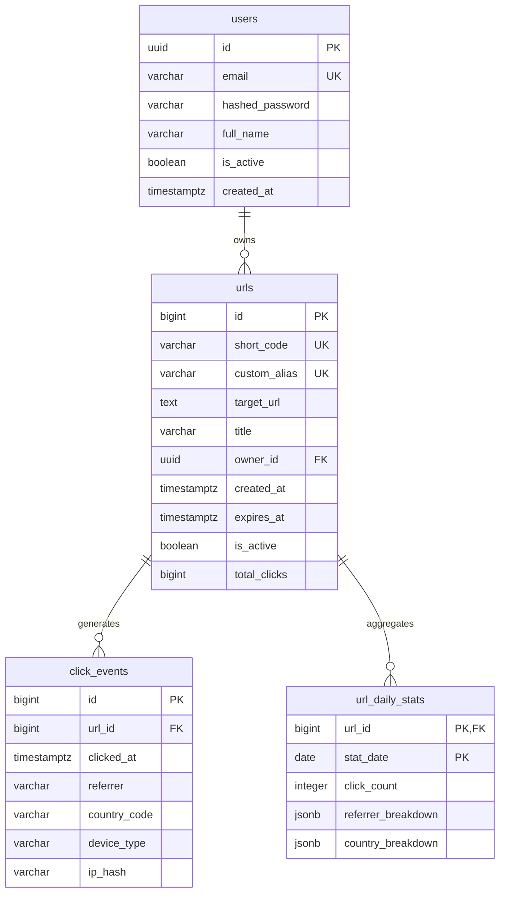

# System Architecture - ShortBrew 📐

This document details the architectural design, core algorithms, database schemas, and resiliency patterns utilized in the ShortBrew URL Shortener.

---

## 🏛 1. Architectural Design Principles

ShortBrew separates its workload into two key paths: the **Redirection Path** (low-latency read hot-path) and the **Analytics Path** (asynchronous write path).

```
                      +-------------------+
                      |   HTTP Request    |
                      +---------+---------+
                                |
                   /------------+------------\
                  /                           \
         [ Redirection Path ]           [ Management Path ]
                 |                              |
         Check Redis Cache             Authentication (JWT)
         - Hit: Redirect Client        CRUD Operations
         - Miss: DB Query & Cache      - Create: Bijective Permutation
                 |                              |
      Publish Async Click Event                 |
                 |                              |
                 v                              v
           +-----------+                  +-----------+
           | RabbitMQ  |                  | PostgreSQL|
           +-----+-----+                  +-----------+
                 |
         [ Analytics Path ]
                 |
         Consume Click Event
         - Deterministic Geo-Mocking
         - Device Classification
         - PostgreSQL Stat Upserts
```

### 1.1 Decoupling Reads from Writes
A typical URL shortener receives significantly more redirection requests (reads) than URL creation requests (writes). Logged click events are even more write-heavy, as every redirect spawns tracking data.

- **Redirection Path**: Requires sub-millisecond response times. It relies entirely on **Redis caching** and does not block on write operations.
- **Analytics Ingestion**: Writing click events directly to a relational database in the request thread would bottleneck the redirection throughput. ShortBrew uses **RabbitMQ** to queue these events, returning the `302 Found` response to the client immediately. A background **TypeScript worker fleet** pulls events off the queue and updates the databases asynchronously.

---

## ⚡️ 2. The Redirection Hot Path & Caching Strategy

The Spring Boot API uses a **Cache-Aside** strategy via Redis:

1. **Redis Lookups**: The redirection service looks up `url:<code_or_alias>` in Redis.
2. **Cache Hits**:
   - The payload contains the target URL, ownership, status, and expiration.
   - If the URL has expired or has been deactivated, the service evicts the key and returns a `410 Gone` (represented as `GoneException`).
   - If valid, the target URL is returned, and a click event is published asynchronously.
3. **Cache Misses**:
   - The system falls back to PostgreSQL.
   - If not found in PostgreSQL, a `404 Not Found` is returned.
   - If found, validation check is run. If invalid/expired, a `410 Gone` is returned.
   - If valid, the URL metadata is written to Redis, with the TTL set to the minimum of 1 hour or the remaining expiration duration.

---

## 🔢 3. Short Code Generation Algorithm

ShortBrew avoids using random strings (which require collision-checking loops) or direct sequential numbers (which allow easy link enumeration). Instead, it uses a **bijective permutation and base-62 encoding** system.

### 3.1 The Logic Flow
For any given URL creation, the generator performs the following:

$$\text{Code} = \text{Base62Encode}(\text{Permute}(\text{DatabaseID} + \text{Offset}))$$

1. **Offsetting**: A constant offset of `10,000,000,000` is added to the database auto-increment ID. This guarantees that even the first URL has a large ID, producing consistent short code lengths (minimum 6 characters).
2. **Bijective Permutation**: The offset ID is passed through a deterministic 64-bit finalizer (based on MurmurHash3's `fmix64` finalizer):
   ```java
   x ^= (x >>> 30);
   x *= 0xbf58476d1ce4e5b9L;
   x ^= (x >>> 27);
   x *= 0x94d049bb133111ebL;
   x ^= (x >>> 31);
   ```
   Because each operation in the finalizer is mathematically reversible (coprime multiplication and XOR shifts), the function is a **bijection** (one-to-one mapping). This mathematically guarantees **zero collisions** while shuffling sequential inputs ($1, 2, 3 \rightarrow \text{completely different, random-looking numbers}$).
3. **Base62 Encoding**: The resulting 64-bit unsigned number is encoded into a URL-safe character set `[0-9a-zA-Z]`.

### 3.2 Trade-offs & Limitations
- **Two-Step Writes**: Because the generator requires the database ID, the application must insert the URL record first to get the ID, compute the short code, and update the database.
- **Obfuscation, Not Encryption**: The permutation is reversible. An attacker who knows the algorithm and constants can reverse a short code back to its original sequential database ID.

---

## 📊 4. Asynchronous Click Analytics & Aggregations

### 4.1 Message Queue Flow
When a redirect occurs, the API publishes a `ClickEventPayload` containing:
- `url_id`: PostgreSQL primary key of the URL.
- `short_code`: The slug processed.
- `referrer`: Values from HTTP headers (`Referer` / `Referrer`).
- `userAgent`: Client User-Agent string.
- `ipHash`: **SHA-256 hash** of the client IP (PII protection).

The message is sent with **persistent delivery mode** to the RabbitMQ exchange `click_events` using routing key `click.created`.

### 4.2 Worker Processing
The TypeScript worker performs the following operations for each event:
1. **Device Classification**: Classifies User-Agent header into `'Mobile'`, `'Tablet'`, or `'Desktop'` via substring matching.
2. **Geo-location Mocking**: Deterministically hashes the `ipHash` to mock a country code from a pool (`US`, `GB`, `DE`, `IN`, `BR`, `JP`, `CA`, `AU`, `FR`, `SG`). This provides realistic analytic graphs without invoking expensive external GeoIP lookups.
3. **Database Insertion**: Runs a PostgreSQL transaction:
   - Inserts raw record into `click_events` table (for detailed analytics history).
   - Increments `total_clicks` in `urls` table.
   - Upserts `url_daily_stats` (records click counts by referrer and country aggregated per URL per day).

### 4.3 Daily Stats Upsert (JSONB Structure)
To keep analytics dashboard queries fast, stats are pre-aggregated daily. The worker performs an upsert into `url_daily_stats` using native JSONB manipulation:
```sql
INSERT INTO url_daily_stats (url_id, stat_date, click_count, referrer_breakdown, country_breakdown)
VALUES ($1, $2, 1, $3::jsonb, $4::jsonb)
ON CONFLICT (url_id, stat_date) DO UPDATE SET
  click_count = url_daily_stats.click_count + 1,
  referrer_breakdown = jsonb_set(
    coalesce(url_daily_stats.referrer_breakdown, '{}'::jsonb),
    ARRAY[$5],
    to_jsonb(coalesce((url_daily_stats.referrer_breakdown->>$5)::int, 0) + 1),
    true
  ),
  country_breakdown = jsonb_set(
    coalesce(url_daily_stats.country_breakdown, '{}'::jsonb),
    ARRAY[$6],
    to_jsonb(coalesce((url_daily_stats.country_breakdown->>$6)::int, 0) + 1),
    true
  )
```
This merges click counts in-database, eliminating the need to read and update aggregates in memory.

---

## 🚦 5. Redis Rate Limiter Engine

Rate limiting is enforced at the controller level using an interceptor that matches `@RateLimit` annotations.

### 5.1 Sliding-Window Log Algorithm
Rather than simple fixed-window counters (which suffer from bursts at boundary lines), ShortBrew uses a sliding-window log implemented via a **Redis Sorted Set (ZSET)** per key.

The sorted set stores unique request identifiers mapped to epoch millisecond timestamps. The logic is executed atomically inside Redis using a **Lua script** (`rate_limiter.lua`):

1. **Cleanup**: Removes all log entries older than the current window (`now - windowMs`) using `ZREMRANGEBYSCORE`.
2. **Cardinality check**: Counts the remaining items inside the ZSET using `ZCARD`.
3. **Evaluation**:
   - If the count is less than the limit, the request is allowed. The current timestamp (plus a random suffix to make it unique) is inserted using `ZADD`, the set's TTL is refreshed (`PEXPIRE`), and `1` is returned.
   - If the count is equal to or greater than the limit, `0` is returned (yielding a `429 Too Many Requests` response).

### 5.2 Fail-Open Design
If the Redis cluster is unreachable or experiences latency, the Spring Boot interceptor catches the exception and **fails-open**, letting traffic pass to ensure rate-limiting issues do not crash the API.

---

## 🗄 6. Database Schema Design

ShortBrew uses PostgreSQL 16. The database initialization script is located at [init-db/init.sql](file:///Users/eldhosepeter/Documents/Projects/ShortBrew/init-db/init.sql).



### 6.1 Users Table (`users`)
Stores authenticated user records.
- `id`: Unique identifier (UUID).
- `email`: User's login email (Indexed, Unique).
- `hashed_password`: Bcrypt hashed password.

### 6.2 URLs Table (`urls`)
Stores shortened link records.
- `id`: Auto-incrementing primary key (`BIGSERIAL`).
- `short_code`: Generated bijective base-62 code.
- `custom_alias`: User-defined string.
- `owner_id`: Foreign key referencing `users.id` (cascades on delete).
- `total_clicks`: Cache-friendly counter incremented on every click event processed.

### 6.3 Click Events Table (`click_events`)
Stores raw click events for history.
- `url_id`: Foreign key referencing `urls.id` (cascades on delete).
- `device_type`: Browser platform (Desktop / Mobile / Tablet).
- `ip_hash`: Client IP hashed with SHA-256 for privacy.

### 6.4 URL Daily Stats Table (`url_daily_stats`)
Aggregates clicks daily.
- `url_id`, `stat_date`: Composite Primary Key.
- `referrer_breakdown`: JSONB map of referrers and their counts (e.g., `{"google.com": 12, "direct": 5}`).
- `country_breakdown`: JSONB map of country codes and their counts (e.g., `{"US": 10, "IN": 7}`).
